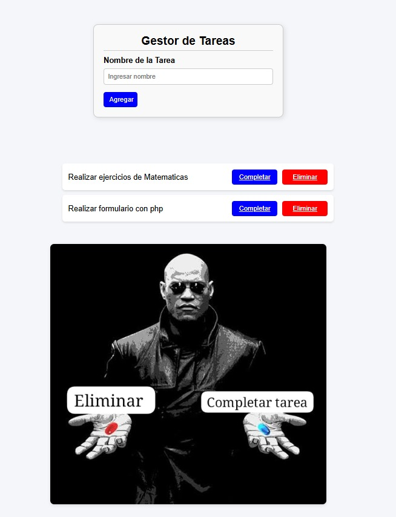

# Desarrollo de Aplicaciones en Internet - Laboratorio 03: Formularios y Manejo de Datos




## 🎯 **Objetivos**
- Desarrollar programas mediante formularios y manejo de datos.
- Uso de arrays en PHP.

## 🔒 **Seguridad**
- 📍 Ubicar maletines y/o mochilas en el gabinete al final del aula de laboratorio.
- 🚫 No ingresar con líquidos ni comida al aula de laboratorio.
- 💻 Al culminar la sesión de laboratorio, apagar correctamente la computadora y el monitor.

## 🛠️ **Equipos, Materiales, Programas y Recursos**
- 💻 PC con sistema operativo Windows.
- ✍️ Editor de Texto: Notepad++, Sublime Text, Visual Studio Code.
- 🔧 Herramienta de desarrollo XAMPP.

## 📚 **Introducción**
En este curso, se desarrollarán ejercicios orientados a la programación de aplicaciones para plataformas Web. Este laboratorio se trabajará de forma individual.

## 📝 **Procedimiento**

### **Actividad:**
**Creación de un sistema de gestión de tareas utilizando arrays y formularios en PHP**

#### **Objetivo:**
Los alumnos trabajarán en grupos de 3 para desarrollar una aplicación web en PHP que permita gestionar una lista de tareas, utilizando formularios para agregar, eliminar y actualizar las tareas, y arrays para almacenar los datos.

#### **Descripción:**
Cada grupo debe crear una página web en PHP donde los usuarios puedan:
- ➕ Agregar nuevas tareas a una lista.
- 📜 Mostrar la lista de tareas actual.
- ❌ Eliminar tareas.
- ✅ Marcar tareas como completadas (opcional).

### **Pasos a seguir:**

1. **Creación del formulario HTML:**
   - El formulario tendrá un campo de texto para ingresar el nombre de la tarea.
   - Un botón para agregar la tarea.

2. **Array para almacenar las tareas:**
   - Crear un array en PHP para almacenar las tareas.
   - Cada tarea puede ser un elemento del array.

3. **Funciones:**
   - Función para agregar una tarea nueva al array.
   - Función para eliminar una tarea (usando el índice del array).
   - Función para marcar una tarea como completada (pueden usar una clase CSS o un atributo en el array).

4. **Mostrar las tareas:**
   - Utilizar un bucle para recorrer el array y mostrar todas las tareas actuales en la página.
   - Cada tarea debe tener un botón de "Eliminar" y "Marcar como completada".

5. **Persistencia temporal:**
   - Como sugerencia, pueden usar sesiones en PHP para mantener la lista de tareas entre recargas de página.

### **Organización sugerida del equipo:**
- **Alumno 1:** Se encargará de crear el formulario HTML y gestionar la recolección de datos.
- **Alumno 2:** Implementará la lógica de PHP para agregar y mostrar las tareas en el array.
- **Alumno 3:** Se encargará de implementar la eliminación y actualización de tareas y aplicar estilos básicos con CSS si es posible.

---

## 💻 **Código de la aplicación**

### **Formulario HTML con php (gestor_tareas.php)**

```html
<?php
if (session_status() == PHP_SESSION_NONE) {
    session_start();
}

if (!isset($_SESSION['tareas'])) {
    $_SESSION['tareas'] = [];
}

// para poder agregar las tareas
if ($_SERVER['REQUEST_METHOD'] === 'POST' && !empty($_POST['nombre'])) {
    $_SESSION['tareas'][] = [
        'tarea' => $_POST['nombre'],
        'completada' => false
    ];
    header("Location: {$_SERVER['PHP_SELF']}");
    exit();
}

// Una vez complatada la tarea
if (isset($_GET['completar'])) {
    $indice = $_GET['completar'];
    if (isset($_SESSION['tareas'][$indice])) {
        $_SESSION['tareas'][$indice]['completada'] = true;
    }
    header("Location: {$_SERVER['PHP_SELF']}");
    exit();
}

// Para eliminar la tarea
if (isset($_GET['eliminar'])) {
    $indice = $_GET['eliminar'];
    if (isset($_SESSION['tareas'][$indice])) {
        unset($_SESSION['tareas'][$indice]);
        $_SESSION['tareas'] = array_values($_SESSION['tareas']); // Reindexar
    }
    header("Location: {$_SERVER['PHP_SELF']}");
    exit();
}

$tareas = $_SESSION['tareas'];
?>


<!DOCTYPE html>
<html lang="es">
<head>
    <meta charset="UTF-8">
    <meta name="viewport" content="width=device-width, initial-scale=1.0">
    <title>Gestor de Tareas</title>
    <style>
        body {
    font-family: Arial, sans-serif;
    background-color: #f4f6f9;
    margin: 0;
    padding: 0;
    display: flex;
    flex-direction: column;
    justify-content: center;
    align-items: center;
    min-height: 100vh;
}

h2 {
    text-align: center;
    width: 100%;
    border-bottom: 2px solid #ccc;
    padding-bottom: 5px;
    margin: 0;
}

form {
    width: 350px;
    margin: 50px auto;
    padding: 20px;
    border: 2px solid #ccc;
    border-radius: 10px;
    background: #f9f9f9;
    box-shadow: 2px 2px 10px rgba(0, 0, 0, 0.1);
}

label {
    display: block;
    margin-top: 10px;
    font-weight: bold;
}

input {
    width: 100%;
    padding: 8px;
    margin-top: 8px;
    border: 1px solid #ccc;
    border-radius: 5px;
    box-sizing: border-box;
}

.buttons {
    margin-top: 15px;
    display: flex;
    justify-content: flex-start;
    gap: 10px;
}

.btn {
    padding: 8px 12px;
    border: none;
    border-radius: 5px;
    cursor: pointer;
    font-size: 14px;
    width: 70px;
    text-align: center;
}

.btn-blue {
    background-color: blue;
    color: white;
}

.btn-red {
    background-color: red;
    color: white;
}

.task-list {
    width: 100%;
    max-width: 600px;
    margin-top: 30px;
}

.task-list li {
    background-color: #fff;
    padding: 12px;
    margin-bottom: 10px;
    border-radius: 6px;
    box-shadow: 0 2px 4px rgba(0, 0, 0, 0.1);
    display: flex;
    justify-content: space-between;
    align-items: center;
}

.task-list li.completada {
    background-color: #d3ffd3;
}

.buttons-task {
    display: flex;
    gap: 10px;
}
    </style>
</head>
<body>
    <!-- Formulario para agregar tareas -->
    <form method="POST" action="">

        <h2>Gestor de Tareas</h2>

        <label for="nombre">Nombre de la Tarea</label>
        <input type="text" id="nombre" name="nombre" placeholder="Ingresar nombre" required>
        
        <div class="buttons">
            <button type="submit" class="btn btn-blue">Agregar</button>
        </div>
    </form>

    <!-- Mostrar las tareas -->
    <div class="task-list">
        <?php if (!empty($tareas)): ?>
            <ul>
                <?php foreach ($tareas as $index => $tarea): ?>
                    <li class="<?php echo $tarea['completada'] ? 'completada' : ''; ?>">
                        <span><?php echo $tarea['tarea']; ?></span>
                        <div class="buttons-task">
                            <?php if (!$tarea['completada']): ?>
                                <a href="?completar=<?php echo $index; ?>" class="btn btn-blue">Completar</a>
                            <?php endif; ?>
                            <a href="?eliminar=<?php echo $index; ?>" class="btn btn-red">Eliminar</a>
                        </div>
                    </li>
                <?php endforeach; ?>
            </ul>
        <?php else: ?>
            <p>No hay tareas para mostrar.</p>
        <?php endif; ?>
    </div>
    <div class="image-container" style="text-align: center; margin-top: 30px;">
        
        </a>
    </div>

</body>
</html>
